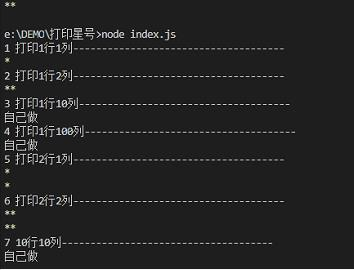
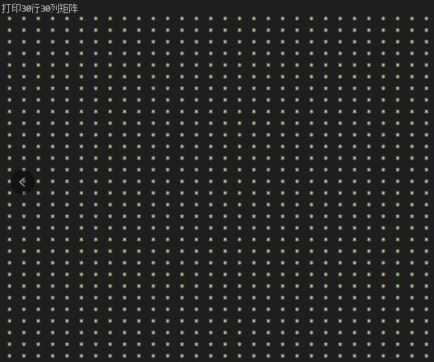

### 练习 1 - for 循环

第一题 打印一个*号 太简单直接公布答案 fmt.printf("*")

第二题横向打印2个星号 其实就是还是很简单。直接公布答案printf("**")

第三题打印10个星号，自己实现。懒人可以敲10个。建议用for循环
```
package main

import "fmt"

func main(){
	
	for a:=0;a<10;a++{
		fmt.Printf("*")
	}
}
```
第四题打印100个。。你如果不用for循环敲100个我也认可
```
package main

import "fmt"

func main(){
	
	for x:=0;x<10;x++{	
		for a:=0;a<10;a++{
			fmt.Printf("*")
			if a==9{fmt.Printf("*\n")}
		}
	}
}
```
第五题，打印2行星号，其实就是写2行printf(*)


第六题。打印2行2列的星号，其实公布答案应该就是printf("**")printf("**")

```
// 这样打印出来的应该就是
**
**
```

第七题，打印10行10列的星号

第八题，打印30行30列矩阵

```
package main

import "fmt"

func main(){
	
	for x:=0;x<30;x++{	
		for a:=0;a<10;a++{
			fmt.Printf("* ")
			if a==9{fmt.Printf("*\n")}
		}		
	}
}
```




第九题，输入个成绩。大于80的优良 大于60的及格 60以下的不及格。用if做一遍，用switch做一遍