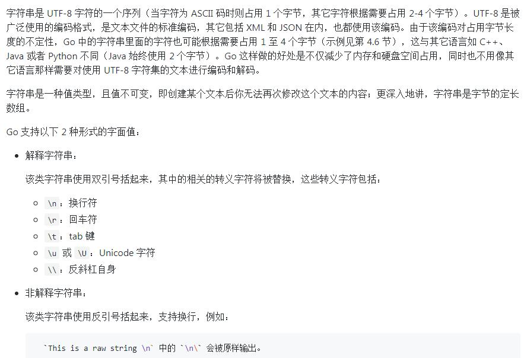

### 一，Go语言格式化字符串

%s: 普通字符串 // string

%q: 引号包含字符串 // 带双引号的字符串 "abc" 或 带单引号的 rune 'c'

%x, %o, %b: 十六进制，8进制，2进制 // 分别为16进制，8进制，2进制形式的int

%t: bool值 // 布尔变量：true 或 false

%d: decimal integer

%v: any value in a natural format // 会将任意变量以易读的形式打印出来

%T: type of any value// 值的类型的Go语法表示

%%: literal percent sign

整数：

%b	表示为二进制

%c	该值对应的unicode码值 // rune (Unicode码点)，Go语言里特有的Unicode字符类型

%d	表示为十进制

%o	表示为八进制

%q	该值对应的单引号括起来的go语法字符字面值，必要时会采用安全的转义表示

%x	表示为十六进制，使用a-f

%X	表示为十六进制，使用A-F

%U	表示为Unicode格式：U+1234，等价于"U+%04X"

浮点数与复数的两个组分：

%b	无小数部分、二进制指数的科学计数法，如-123456p-78；参见strconv.FormatFloat

%e	科学计数法，如-1234.456e+78

%E	科学计数法，如-1234.456E+78

%f	有小数部分但无指数部分，如123.456

%F	等价于%f

%g	根据实际情况采用%e或%f格式（以获得更简洁、准确的输出）

%G	根据实际情况采用%E或%F格式（以获得更简洁、准确的输出）

### 二，字符串



* 拼接的简写形式 += 也可以用于字符串：
```
s := "hel" + "lo,"
s += "world!"
fmt.Println(s) //输出 “hello, world!”
```
* 在循环中使用加号 + 拼接字符串并不是最高效的做法，更好的办法是使用函数 strings.Join()，有没有更好地办法了？有！使用字节缓冲（bytes.Buffer）拼接更加给力