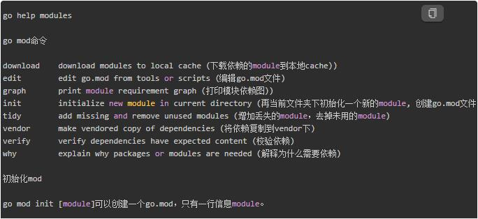
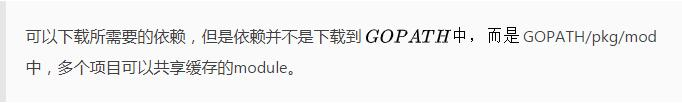
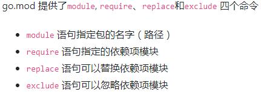
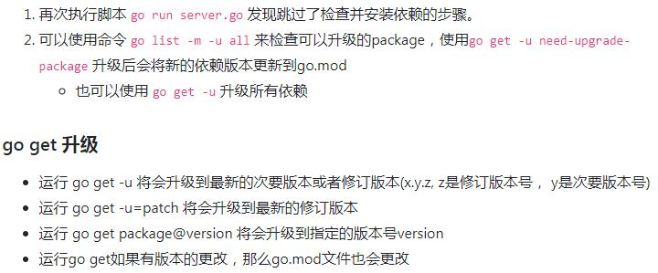
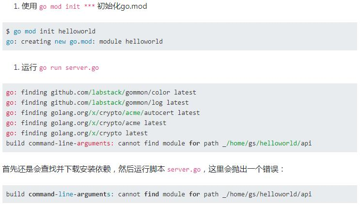
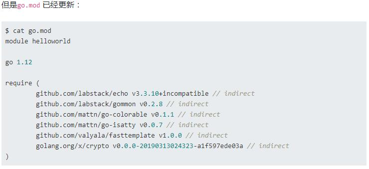
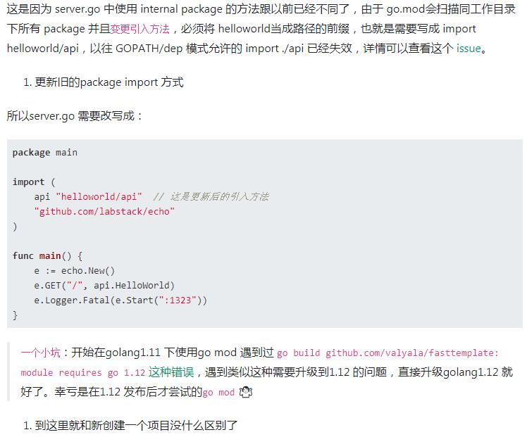

### GO MOD 入门

#### 一，写在前面，我们要切换到go mod吗
>go mod是官方力推的go模块依赖管理的工具，有官方的背书，肯定是要用的。go1.13已经默认支持了，所以迟早要切到go mod, 势不可挡。

#### 二，go mod能做什么
>go mod能管理的依赖包的版本，能保证在不同地方构建，获得的依赖模块是一致的。
* 没有go mod之前如何管理包依赖: 没有go mod之前，有go deps, vendor等方法来解决。

#### 三，go mod的基本使用
GO111MODULE可以设置为三个字符串值之一：off，on或auto（默认值）。
* on 则go命令需要使用模块，go 会忽略 $GOPATH 和 vendor 文件夹，只根据go.mod下载依赖。
* auto 或未设置，则go命令根据当前目录启用或禁用模块支持。仅当当前目录位于$GOPATH/src之外并且其本身包含go.mod文件或位于包含go.mod文件的目录下时，才启用模块支持

> 如果需要查看go module的详细文档(非常长)，可以在控制台输入


go命令通过查找当前目录中的go.mod或者当前目录的父目录，或者祖父目录，依次递归查找。
go.mod文件可以通过require，replace和exclude语句使用的精确软件包集。

* require语句指定的依赖项模块
* replace语句可以替换依赖项模块
* exclude语句可以忽略依赖项模块
* go mod download

> 

> [GO依赖包管理工具对比](https://ieevee.com/tech/2017/07/10/go-import.html)

> [golang使用vendor目录来管理依赖包](https://studygolang.com/articles/10312)

> 重点： 对于go来说，其实并不care你的代码是内部还是外部的，总之都在GOPATH里，任何import包的路径都是从GOPATH开始的；唯一的区别，就是内部依赖的包是开发者自己写的，外部依赖的包是go get下来的。


* 在国内访问 golang.org/x 的各个包都需要翻墙，你可以在go.mod中使用replace替换成github上对应的库。
```
replace (
    golang.org/x/crypto v0.0.0-20180820150726-614d502a4dac => github.com/golang/crypto v0.0.0-20180820150726-614d502a4dac
    golang.org/x/net v0.0.0-20180821023952-922f4815f713 => github.com/golang/net v0.0.0-20180826012351-8a410e7b638d
    golang.org/x/text v0.3.0 => github.com/golang/text v0.3.0
)
```
>或者

`
replace golang.org/x/crypto v0.0.0-20190313024323-a1f597ede03a => github.com/golang/crypto v0.0.0-20190313024323-a1f597ede03a
`

* go clean -modcache 清除缓存
> go mod 新东西偶尔还会出现问题 ,这个命令可以尝试修复,不过执行之前可以考虑备份一下pkg/mod中的包.以防不测

#### 四， go mod 如何在项目中使用 
> [本章节内容来源](https://segmentfault.com/a/1190000018536993)

##### 示例一：创建一个新项目

> 在GOPATH 目录之外新建一个目录，并使用go mod init 初始化生成go.mod 文件
```
➜  ~ mkdir hello
➜  ~ cd hello
➜  hello go mod init hello
go: creating new go.mod: module hello
➜  hello ls
go.mod
➜  hello cat go.mod
module hello

go 1.12
```
* go.mod文件一旦创建后，它的内容将会被go toolchain全面掌控。go toolchain会在各类命令执行时，比如go get、go build、go mod等修改和维护go.mod文件。

* 【重温】
> 

##### 1.添加依赖
> Step 1: 新建一个 server.go 文件，写入以下代码：
```
package main

import (
    "net/http"
    
    "github.com/labstack/echo"
)

func main() {
    e := echo.New()
    e.GET("/", func(c echo.Context) error {
        return c.String(http.StatusOK, "Hello, World!")
    })
    e.Logger.Fatal(e.Start(":1323"))
}
```
> Step 2: 执行 go run server.go 运行代码会发现 go mod 会自动查找依赖自动下载
```
$ go run server.go
go: finding github.com/labstack/echo v3.3.10+incompatible
go: downloading github.com/labstack/echo v3.3.10+incompatible
go: extracting github.com/labstack/echo v3.3.10+incompatible
go: finding github.com/labstack/gommon/color latest
go: finding github.com/labstack/gommon/log latest
go: finding github.com/labstack/gommon v0.2.8
# 此处省略很多行
...

   ____    __
  / __/___/ /  ___
 / _// __/ _ \/ _ \
/___/\__/_//_/\___/ v3.3.10-dev
High performance, minimalist Go web framework
https://echo.labstack.com
____________________________________O/_______
                                    O\
⇨ http server started on [::]:1323
```
> Step 3: 现在查看go.mod 内容
```
$ cat go.mod

module hello

go 1.12

require (
    github.com/labstack/echo v3.3.10+incompatible // indirect
    github.com/labstack/gommon v0.2.8 // indirect
    github.com/mattn/go-colorable v0.1.1 // indirect
    github.com/mattn/go-isatty v0.0.7 // indirect
    github.com/valyala/fasttemplate v1.0.0 // indirect
    golang.org/x/crypto v0.0.0-20190313024323-a1f597ede03a // indirect
)
```
> Step 4: go module 安装 package 的原則是先拉最新的 release tag，若无tag则拉最新的commit，详见 Modules官方介绍。 go 会自动生成一个 go.sum 文件来记录 dependency tree
```
$ cat go.sum
github.com/labstack/echo v3.3.10+incompatible h1:pGRcYk231ExFAyoAjAfD85kQzRJCRI8bbnE7CX5OEgg=
github.com/labstack/echo v3.3.10+incompatible/go.mod h1:0INS7j/VjnFxD4E2wkz67b8cVwCLbBmJyDaka6Cmk1s=
github.com/labstack/gommon v0.2.8 h1:JvRqmeZcfrHC5u6uVleB4NxxNbzx6gpbJiQknDbKQu0=
github.com/labstack/gommon v0.2.8/go.mod h1:/tj9csK2iPSBvn+3NLM9e52usepMtrd5ilFYA+wQNJ4=
github.com/mattn/go-colorable v0.1.1 h1:G1f5SKeVxmagw/IyvzvtZE4Gybcc4Tr1tf7I8z0XgOg=
github.com/mattn/go-colorable v0.1.1/go.mod h1:FuOcm+DKB9mbwrcAfNl7/TZVBZ6rcnceauSikq3lYCQ=
//... 省略很多行
```
>

##### 示例二：改造现有项目(helloword)
> Step 1: 项目目录为
```
$ tree
.
├── api
│   └── apis.go
└── server.go

1 directory, 2 files
```
> Step 2: server.go 源码为
```
package main

import (
    api "./api"  // 这里使用的是相对路径
    "github.com/labstack/echo"
)

func main() {
    e := echo.New()
    e.GET("/", api.HelloWorld)
    e.Logger.Fatal(e.Start(":1323"))
}
```
> Step 3: api/apis.go 源码为
```
package api

import (
    "net/http"

    "github.com/labstack/echo"
)

func HelloWorld(c echo.Context) error {
    return c.JSON(http.StatusOK, "hello world")
}
```
>

>

>【那为什么会抛出这个错误呢？】
>

#### 参考链接
* [Modules官方介绍](https://github.com/golang/go/wiki/Modules)
* [Golang 1.11 新功能介紹 – Modules](https://www.lightblue.asia/golang-1-11-new-festures-modules/?doing_wp_cron=1552464864.6369309425354003906250)
* [What are Go modules and how do I use them?](https://talks.godoc.org/github.com/myitcv/talks/2018-08-15-glug-modules/main.slide#1)
* [go mod doesn't work for](https://github.com/golang/go/issues/27565)
* [再探go modules：使用与细节](https://www.cnblogs.com/apocelipes/p/10295096.html)
* [初窥Go module](https://tonybai.com/2018/07/15/hello-go-module/)