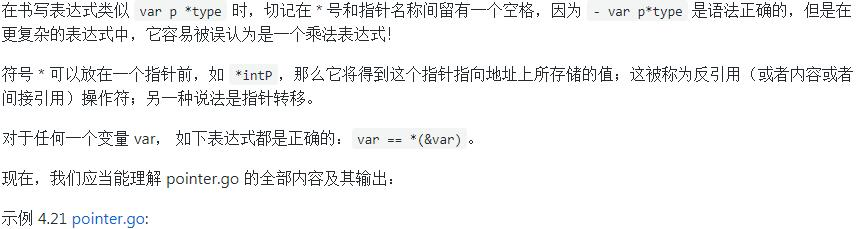
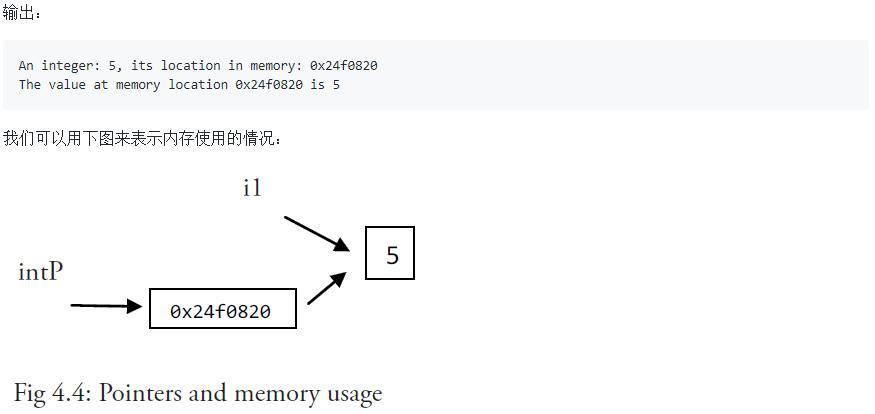

### 指针

>不像 Java 和 .NET，Go 语言为程序员提供了控制数据结构的指针的能力；但是，你不能进行指针运算。通过给予程序员基本内存布局，Go 语言允许你控制特定集合的数据结构、分配的数量以及内存访问模式，这些对构建运行良好的系统是非常重要的：指针对于性能的影响是不言而喻的，而如果你想要做的是系统编程、操作系统或者网络应用，指针更是不可或缺的一部分。

>程序在内存中存储它的值，每个内存块（或字）有一个地址，通常用十六进制数表示，如：0x6b0820 或 0xf84001d7f0。
* Go 语言的取地址符是 &，放到一个变量前使用就会返回相应变量的内存地址。

>下面的代码片可能输出 An integer: 5, its location in memory: 0x6b0820（这个值随着你每次运行程序而变化）。
```
var i1 = 5
fmt.Printf("An integer: %d, it's location in memory: %p\n", i1, &i1)
```
>这个地址可以存储在一个叫做指针的特殊数据类型中，在本例中这是一个指向 int 的指针，即 i1：此处使用 *int 表示。如果我们想调用指针 intP，我们可以这样声明它：
` var intP *int `

>然后使用 intP = &i1 是合法的，此时 intP 指向 i1。
* 指针的格式化标识符为 %p

#### 一个指针变量可以指向任何一个值的内存地址
>它指向那个值的内存地址，在 32 位机器上占用 4 个字节，在 64 位机器上占用 8 个字节，并且与它所指向的值的大小无关。当然，可以声明指针指向任何类型的值来表明它的原始性或结构性；你可以在指针类型前面加上 * 号（前缀）来获取指针所指向的内容，这里的 * 号是一个类型更改器。使用一个指针引用一个值被称为间接引用。
* 当一个指针被定义后没有分配到任何变量时，它的值为 nil
* 一个指针变量通常缩写为 ptr

>【注意】
>
```
package main
import "fmt"
func main() {
	var i1 = 5
	fmt.Printf("An integer: %d, its location in memory: %p\n", i1, &i1)
	var intP *int
	intP = &i1
	fmt.Printf("The value at memory location %p is %d\n", intP, *intP)
}
```
>


