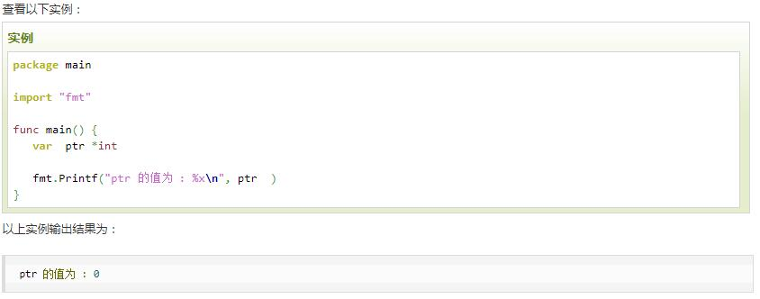
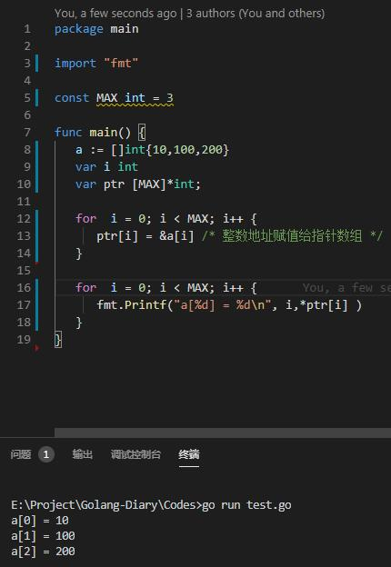
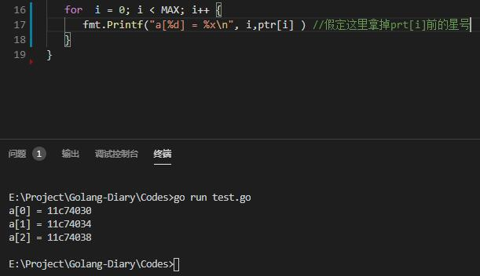
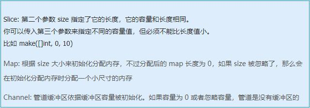

### **指针**

#### **一，指针的概念**
#### **1.1 指针的声明or定义**
>不像 Java 和 .NET，Go 语言为程序员提供了控制数据结构的指针的能力；但是，你不能进行指针运算。通过给予程序员基本内存布局，Go 语言允许你控制特定集合的数据结构、分配的数量以及内存访问模式，这些对构建运行良好的系统是非常重要的：指针对于性能的影响是不言而喻的，而如果你想要做的是系统编程、操作系统或者网络应用，指针更是不可或缺的一部分。

>程序在内存中存储它的值，每个内存块（或字）有一个地址，通常用十六进制数表示，如：0x6b0820 或 0xf84001d7f0。
* Go 语言的取地址符是 &，放到一个变量前使用就会返回相应变量的内存地址。

>下面的代码片可能输出 An integer: 5, its location in memory: 0x6b0820（这个值随着你每次运行程序而变化）。
```
var i1 = 5
fmt.Printf("An integer: %d, it's location in memory: %p\n", i1, &i1)
```
>这个地址可以存储在一个叫做指针的特殊数据类型中，在本例中这是一个指向 int 的指针，即 i1：此处使用 *int 表示。如果我们想调用指针 intP，我们可以这样声明它：
` var intP *int `
* `var`是声明的格式，这里声明`intp`的类型为`*int`
* 变量intp的地址使用
>然后使用 intP = &i1 是合法的，此时 intP 指向 i1。
* 指针的格式化标识符为 %p
* 此时，变量`i1`的地址使用变量`intp`进行接受，`intp`的类型为`*int`,称做`int`的指针类型,`*`代表指针。
> 假如：`ptr := &v    // v 的类型为 T`
* 其中 v 代表被取地址的变量，变量 v 的地址使用变量 ptr 进行接收，ptr 的类型为*T，称做 T 的指针类型，*代表指针。
#### **1.2 一个指针变量可以指向任何一个值的内存地址**
>它指向那个值的内存地址，在 32 位机器上占用 4 个字节，在 64 位机器上占用 8 个字节，并且与它所指向的值的大小无关。当然，可以声明指针指向任何类型的值来表明它的原始性或结构性；你可以在指针类型前面加上 * 号（前缀）来获取指针所指向的内容，这里的 * 号是一个类型更改器。使用一个指针引用一个值被称为间接引用。
* 任意变量x本身有两层含义：1) 变量的内存/值 2)变量的地址
* 当一个指针被定义后没有分配到任何变量时，它的值为 nil
* 一个指针变量通常缩写为 ptr

>【注意】
>
```go
package main
import "fmt"
func main() {
	var i1 = 5
	fmt.Printf("An integer: %d, its location in memory: %p\n", i1, &i1)
	var intP *int
	intP = &i1
	fmt.Printf("The value at memory location %p is %d\n", intP, *intP)
}
```
>


#### **二，Go语言中指针的一些用法**
#### **2.1 空指针**

当一个指针被定义后没有分配到任何变量时，它的值为 nil。

nil 指针也称为空指针。

nil在概念上和其它语言的null、None、nil、NULL一样，都指代零值或空值。

一个指针变量通常缩写为 ptr。




*_空指针的判断：_*

>` if(ptr != nil)     /* ptr 不是空指针 */ `

>` if(ptr == nil)    /* ptr 是空指针 */ `

##### **2.2 Go 语言指针数组**

有一种情况，我们可能需要保存数组，这样我们就需要使用到指针。
* 以下声明了整型指针数组：
`var ptr [MAX]*int`

ptr 为整型指针数组。因此每个元素都指向了一个值。以下实例的三个整数将存储在指针数组中：


* 从下面代码的改动可以看到，ptr[i]本身已经局部变量定义为指向int存储地址的指针，不加星号，返回的是存储地址；加星号，被称为反引用。



##### **2.3 指针反引用**

```go
package main
import "fmt"
func main() {
    s := "good bye"
    var p *string = &s
    *p = "ciao"
    fmt.Printf("Here is the pointer p: %p\n", p) // prints address
    fmt.Printf("Here is the string *p: %s\n", *p) // prints string
    fmt.Printf("Here is the string s: %s\n", s) // prints same string
}
```
*输出结果：*
```go
Here is the pointer p: 0x2540820
Here is the string *p: ciao
Here is the string s: ciao // 通过对 *p 赋另一个值来更改 “对象”，这样 s 也会随之更改。
```
* 通过对 *p 赋另一个值来更改 “对象”，这样 s 也会随之更改。

##### **2.4 new函数和make函数**

* new函数定义： 是Go语言的内建函数，内建函数 new 用来分配内存，它的第一个参数是一个类型，不是一个值，它的返回值是一个指向新分配类型零值的指针
    * 相当于`func new(Type) *Type`
    * 所以，`someInt := new(int)`，返回的值是int类型的指针
* make函数定义：是Go语言的内建函数，用来为 slice，map 或 chan 类型分配内存和初始化一个对象(注意：只能用在这三种类型上)
    * 跟 new 类似，第一个参数也是一个类型而不是一个值
    * 跟 new 不同的是，make 返回类型的引用而不是指针，而返回值也依赖于具体传入的类型
    * 具体说明如下：
    
    
    
    
    

##### **2.5 值传递 & 地址传递**
> 2.5.1 值传递
```go
package main

import "fmt"

func swap1(a,b int){
	a,b = b,a
}

func swap2(a,b int){
	a,b = b,a
	fmt.Printf("swap2: a =%d , b=%d\n ",a,b)
}

func main() {
	a,b:=10,20
	fmt.Printf("main: a =%d , b=%d\n ",a,b)
	swap1(a,b)
	fmt.Printf("swap1: a =%d , b=%d\n ",a,b)
	swap2(a,b)
}
```
*输出结果：*
```go
main: a =10 , b=20
 swap1: a =10 , b=20
 swap2: a =20 , b=10
```    
* 【重点】- main函数中，a，b作为传参时，其本身的值是不变的，函数swap1中只是对a，b进行引用。

> 2.5.2地址传递
```go
package main

import "fmt"

func swap1(a,b int){
	a,b = b,a
	fmt.Printf("swap1: a =%d , b=%d\n ",a,b)
}

func swap2(p1,p2 *int){
	*p1,*p2 = *p2,*p1

}

func main() {
	a,b:=10,20
	fmt.Printf("main: a =%d , b=%d\n ",a,b)
	swap1(a,b)
	swap2(&a,&b)
	fmt.Printf("swap2: a =%d , b=%d\n ",a,b)
}
```
*输出结果：*
```go
main: a =10 , b=20
 swap1: a =20 , b=10
 swap2: a =20 , b=10
```
* 【重点】- 当利用指针对他们的地址进行交换时，同样是在main的作用域内，a，b的值发生了交换。
##### **注意事项**
* 1，你不能得到一个文字或常量的地址，例如：
```go
const i = 5
ptr := &i //error: cannot take the address of i
ptr2 := &10 //error: cannot take the address of 10
```

* 2，指针的一个高级应用是你可以传递一个变量的引用（如函数的参数），这样不会传递变量的拷贝。指针传递是很廉价的，只占用 4 个或 8 个字节。当程序在工作中需要占用大量的内存，或很多变量，或者两者都有，使用指针会减少内存占用和提高效率。被指向的变量也保存在内存中，直到没有任何指针指向它们，所以从它们被创建开始就具有相互独立的生命周期。

* 3，指针也可以指向另一个指针，并且可以进行任意深度的嵌套，导致你可以有多级的间接引用，但在大多数情况这会使你的代码结构不清晰

* 4，在大多数情况下 Go 语言可以使程序员轻松创建指针，并且隐藏间接引用，如：自动反向引用。*对一个空指针的反向引用是不合法的，并且会使程序崩溃*

```go
package main
func main() {
    var p *int = nil
    *p = 0
}
// in Windows: stops only with: <exit code="-1073741819" msg="process crashed"/>
// runtime error: invalid memory address or nil pointer dereference
```
* 5，不要操作没有合法指向的内存：

    即，在变量却是或者指针没有指向任何变量时，`var ptr *Type`后不可进行`*ptr`的操作
