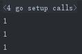
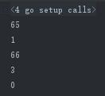

#### **常量**

##### *一，常量的定义*

常量使用关键字 const 定义，用于存储不会改变的数据。

存储在常量中的数据类型只可以是布尔型、数字型（整数型、浮点型和复数）和字符串型。
* 常量的定义格式：const identifier [type] = value，例如：
`const Pi = 3.14159`
* 显式类型定义： `const b string = "abc"`
* 隐式类型定义： `const b = "abc"`

##### *二，常量的表达方式*
如果第一个常量定义后，其余常量未定义，其余常量默认使用第一个常量定义的格式内容
>例如:
```bazaar
package main

import(
"fmt"
)

const (
a = 1
b
c
)

func main(){
fmt.println(a)
fmt.println(b)
fmt.println(c)
}
```
输出结果：



<font color=#FF0000 >常量可以用作枚举</font>

<font color=#0000FF >iota</font>可以被用作枚举值

>例1：
```
const (
	a = iota
	b = iota
	c = iota
)
```
* 第一个 iota 等于 0，每当 iota 在新的一行被使用时，它的值都会自动加 1；所以 a=0, b=1, c=2
* 也可以简写为：
```
const (
	a = iota
	b 
	c 
)
```
>例2：

```
package main

import( "fmt")

const (
	a = 'A'
	b = iota
	c = 'B'
	d = iota
)
const (e=iota)

func main(){
fmt.Println(a) //常量只能是数字型，这里强制转变为数字65
fmt.Println(b) //iota枚举时第一个常量为0，此为第二行，显示为1
fmt.Println(c) //常量只能是数字型，这里强制转变为数字66
fmt.Println(d) //iota枚举时第一个常量为0，此为第四行，显示为3
fmt.Println(e) // 在每遇到一个新的常量块或单个常量声明时， iota 都会重置为 0（ 简单地讲，每遇到一次 const 关键字，iota 就重置为 0 ）
}
```
输出结果：



####  **运算符**
> [信息来源](https://www.runoob.com/go/go-operators.html)

