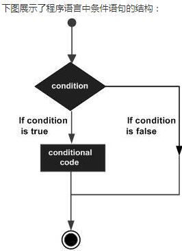
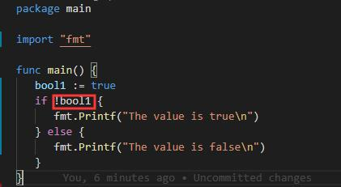

### **控制结构**

到目前为止，我们看到的 Go 程序都是从 main() 函数开始执行，然后按顺序执行该函数体中的代码。但我们经常会需要只有在满足一些特定情况时才执行某些代码，也就是说在代码里进行条件判断。针对这种需求，Go 提供了下面这些条件结构和分支结构：
* if-else 结构
* switch 结构
* select 结构，用于 channel 的选择
> 可以使用迭代或循环结构来重复执行一次或多次某段代码（任务）
* for (range) 结构
> 一些如 break 和 continue 这样的关键字可以用于中途改变循环的状态。

> 此外，你还可以使用 return 来结束某个函数的执行，或使用 goto 和标签来调整程序的执行位置。

#### **一，if-else 结构**

if 是用于测试某个条件（布尔型或逻辑型）的语句，如果该条件成立，则会执行 if 后由大括号括起来的代码块，否则就忽略该代码块继续执行后续的代码。
```
if condition {
	// do something	
}
````


如果存在第二个分支，则可以在上面代码的基础上添加 else 关键字以及另一代码块，这个代码块中的代码只有在条件不满足时才会执行。if 和 else 后的两个代码块是相互独立的分支，只可能执行其中一个。
```
if condition {
	// do something	
} else {
	// do something	
}
```
如果存在第三个分支，则可以使用下面这种三个独立分支的形式：
```
if condition1 {
	// do something	
} else if condition2 {
	// do something else	
} else {
	// catch-all or default
}
```
else-if 分支的数量是没有限制的，但是为了代码的可读性，还是不要在 if 后面加入太多的 else-if 结构。如果你必须使用这种形式，则把尽可能先满足的条件放在前面。
* 即使当代码块之间只有一条语句时，大括号也不可被省略

*关键字 if 和 else 之后的左大括号 { 必须和关键字在同一行，如果你使用了 else-if 结构，则前段代码块的右大括号 } 必须和 else-if 关键字在同一行。这两条规则都是被编译器强制规定的。*
```
if x{
}
else {	// 无效的
}
```
##### **示例1**
```
package main
import "fmt"
func main() {
	bool1 := true
	if bool1 {
		fmt.Printf("The value is true\n")
	} else {
		fmt.Printf("The value is false\n")
	}
}
```
##### **输出:**  ` The value is true `
* 如果对bool1取反



##### **输出:**  ` The value is false `

* **【注意事项】** 
这里不需要使用 if bool1 == true 来判断，因为 bool1 本身已经是一个布尔类型的值。

*当 if 结构内有 break、continue、goto 或者 return 语句时*，Go 代码的常见写法是省略 else 部分。无论满足哪个条件都会返回 x 或者 y 时，一般使用以下写法：
```
if condition {
	return x
}
return y
```
* **【注意事项】** 
不要同时在 if-else 结构的两个分支里都使用 return 语句，这将导致编译报错 function ends without a return statement（你可以认为这是一个编译器的 Bug 或者特性）

##### **一些有用的例子**
1. 函数 Abs() 用于返回一个整型数字的绝对值:
```
func Abs(x int) int {
 	if x < 0 {
 		return -x
 	}
 	return x	
 }
 ```
 2. isGreater 用于比较两个整型数字的大小:
 ```
 func isGreater(x, y int) bool {
 	if x > y {
 		return true	
 	}
 	return false
 }
 ```
 3. if 可以包含一个初始化语句（如：给一个变量赋值）。这种写法具有固定的格式（在初始化语句后方必须加上分号）：
 ```
 if initialization; condition {
	// do something
}
```
**例如** （一般写法）
```
val := 10
if val > max {
	// do something
}
```
你也可以这样写:
```
if val := 10; val > max {
	// do something
}
```

* **【注意事项】** 使用简短方式 := 声明的变量的作用域只存在于 if 结构中（在 if 结构的大括号之间，如果使用 if-else 结构则在 else 代码块中变量也会存在）。如果变量在 if 结构之前就已经存在，那么在 if 结构中，该变量原来的值会被隐藏。最简单的解决方案就是不要在初始化语句中声明变量

##### **示例2**
```go
package main

import "fmt"

func main() {
	var first int = 10
	var cond int

	if first <= 0 {
		fmt.Printf("first is less than or equal to 0\n")
	} else if first > 0 && first < 5 {
		fmt.Printf("first is between 0 and 5\n")
	} else {
		fmt.Printf("first is 5 or greater\n")
	}
	if cond = 5; cond > 10 {
		fmt.Printf("cond is greater than 10\n")
	} else {
		fmt.Printf("cond is not greater than 10\n")
	}
}
```
*输出*
```
first is 5 or greater
cond is not greater than 10
```

下面的代码片段展示了如何通过在初始化语句中获取函数 `process()` 的返回值，并在条件语句中作为判定条件来决定是否执行 if 结构中的代码：

```go
if value := process(data); value > max {
    ...
}
```
