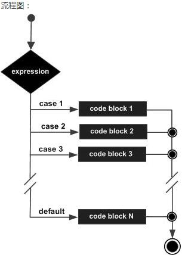

### **switch 结构**

#### **一，switch的基本结构**

```
switch var1 {
	case val1:
		...
	case val2:
		...
	default:
		...
}
```

#### 变量 var1 可以是任何类型，而 val1 和 val2 则可以是同类型的任意值。类型不被局限于常量或整数，但必须是相同的类型；或者最终结果为相同类型的表达式。前花括号 { 必须和 switch 关键字在同一行。

* 您可以同时测试多个可能符合条件的值，使用逗号分割它们，例如：
` case val1, val2, val3 `

* 每一个 case 分支都是唯一的，从上至下逐一测试，直到匹配为止。（ Go 语言使用快速的查找算法来测试 switch 条件与 case 分支的匹配情况，直到算法匹配到某个 case 或者进入 default 条件为止。）一旦成功地匹配到某个分支，在执行完相应代码后就会退出整个 switch 代码块，也就是说您不需要特别使用 break 语句来表示结束。

* 因此，程序也不会自动地去执行下一个分支的代码。如果在执行完每个分支的代码后，还希望继续执行后续分支的代码，可以使用 fallthrough 关键字来达到目的。

**示例**
```
switch i {
	case 0: // 空分支，只有当 i == 0 时才会进入分支
	case 1:
		f() // 当 i == 0 时函数不会被调用
}
```
**_并且_**
```
switch i {
	case 0: fallthrough
	case 1:
		f() // 当 i == 0 时函数也会被调用
}
```

#### **defualt 分支**

可选的 default 分支可以出现在任何顺序，但最好将它放在最后。它的作用类似与 if-else 语句中的 else，表示不符合任何已给出条件时，执行相关语句。

**示例**
```
package main

import "fmt"

func main() {
	var num1 int = 100

	switch num1 {
	case 98, 99:
		fmt.Println("It's equal to 98")
	case 100: 
		fmt.Println("It's equal to 100")
	default:
		fmt.Println("It's not equal to 98 or 100")
	}
}
```
**_输出：_** ` It's equal to 100 `

#### **二，switch 语句的第二种形式是不提供任何被判断的值**

```
// 基本结构
switch {
	case condition1:
		...
	case condition2:
		...
	default:
		...
}
```

**例如**
```
switch {
	case i < 0:
		f1()
	case i == 0:
		f2()
	case i > 0:
		f3()
}
```
* 此时，switch默认为判断是否为 true，然后在每个 case 分支中进行测试不同的条件。当任一分支的测试结果为 true 时，该分支的代码会被执行。这看起来非常像链式的 if-else 语句，但是在测试条件非常多的情况下，提供了可读性更好的书写方式。

***** **任何支持进行相等判断的类型都可以作为测试表达式的条件，包括 int、string、指针等。**

**比如：**
```
package main

import "fmt"

func main() {
	var num1 int = 7

	switch {
	    case num1 < 0:
		    fmt.Println("Number is negative")
	    case num1 > 0 && num1 < 10:
		    fmt.Println("Number is between 0 and 10")
	    default:
		    fmt.Println("Number is 10 or greater")
	}
}
```

#### **三，switch 语句的第三种形式是包含一个初始化语句**

**_泛型_**
```
switch initialization {
	case val1:
		...
	case val2:
		...
	default:
		...
}
```
* 这种形式可以非常优雅地进行条件判断：
**示例 1**
```
switch result := calculate() {
	case result < 0:
		...
	case result > 0:
		...
	default:
		// 0
}
```

**示例 2**
```
switch a, b := x[i], y[j] {
	case a < b: t = -1
	case a == b: t = 0
	case a > b: t = 1
}
```