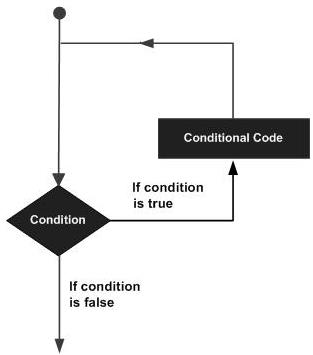
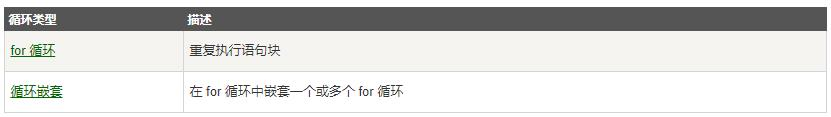
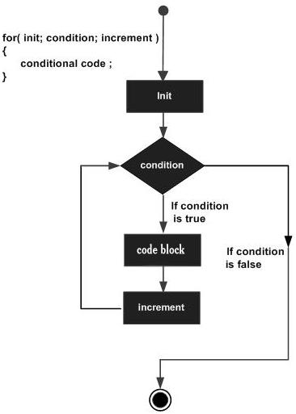
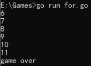
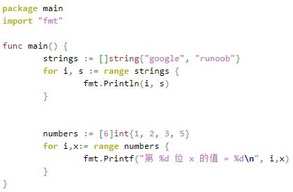

### **循环语句for**

#### **一，for循环语句结构**
如果想要重复执行某些语句，Go 语言中您只有 for 结构可以使用。不要小看它，这个 for 结构比其它语言中的更为灵活。
* 以下为大多编程语言循环程序的流程图：


* Go 语言提供了以下几种类型循环处理语句：


#### **1. for循环**
**_1.1 - 语法_** :
Go 语言的 For 循环有 3 种形式，只有其中的一种使用分号。

形式1：和 C 语言的 for 一样：

`for init; condition; post { }`

形式2： 和 C 的 while 一样：

`for condition { }`

形式3： 和 C 的 for(;;) 一样：
     
`for { }`

* **init**： 一般为赋值表达式，给控制变量赋初值；
* **condition**： 关系表达式或逻辑表达式，循环控制条件；
* **post**： 一般为赋值表达式，给控制变量增量或减量

**_1.2 - for语句执行过程及流程_**

for语句执行过程如下：
* 1、先对表达式 1 赋初值；
* 2、判别赋值表达式 init 是否满足给定条件，若其值为真，满足循环条件，则执行循环体内语句，然后执行 post，进入第二次循环，再判别 condition；否则判断 condition 的值为假，不满足条件，就终止for循环，执行循环体外语句。
* 3、for语句语法流程如下图所示：



**_实例 1 -_** condition 套用函数

```
package main

import (
	"fmt"
)

var a = 5
var b = "string"

func main() {

	for i := 0; i < len(b); i++ {
		a++
		fmt.Println(a)
	}

	fmt.Println("game over")
}
```
**输出结果:**


* **值得注意的是：** for语法结构中condition若存在函数，是比较吃内存的，因为每循环一次都要检测这个函数。条件允许的情况下考虑把该函数转为局部/全局变量
比如：
```
package main

import (
	"fmt"
)

var a = 5
var b = "string"
var x = len(b) // 这里用全局变量x代替上例中for语法结构中的函数
func main() {

	for i := 0; i < x; i++ {
		a++
		fmt.Println(a)
	}

	fmt.Println("game over")
}
```
**_实例 2 -_** 无限循环:
```
package main

import "fmt"

func main() {
        sum := 0
        for {
            sum++ // 无限循环下去
        }
        fmt.Println(sum) // 无法输出
}
```
* **小提示**： 要停止无限循环，可以在命令窗口按下ctrl+c 。

**_实例 3 -_** For-each range 循环



*输出结果*:
```
0 google
1 runoob
第 0 位 x 的值 = 1
第 1 位 x 的值 = 2
第 2 位 x 的值 = 3
第 3 位 x 的值 = 5
第 4 位 x 的值 = 0
第 5 位 x 的值 = 0
```
**_实例 4 -_**九九乘法表
```
//自己的傻瓜套路
package main

import "fmt"

var a,b,c,d int

func main() {
b:=[]int{1,2,3,4,5,6,7,8,9}

    for a:=1;a<10;a++{
	    for d:= range b {
	    c=a*b[d]
	    fmt.Printf("%d * %d = %d\n",a,b[d],c)
        }
    }
}
```
* 跟下面的精简方案比，多用了一个参数，一个数组，和一个函数

```
package main

import "fmt"

var a, b, c int

func main() {

	for a := 1; a < 10; a++ {
		for b := 1; b < 10; b++ {
			c = a * b
			fmt.Printf("%d * %d = %d\n", a, b, c)
		}
	}
}
```