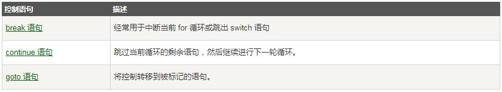
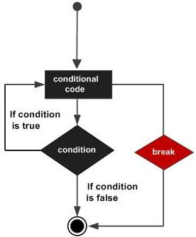
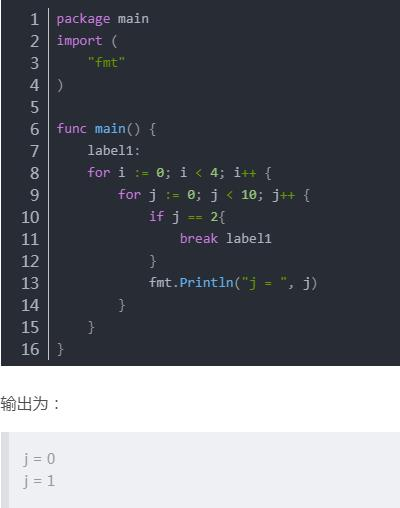
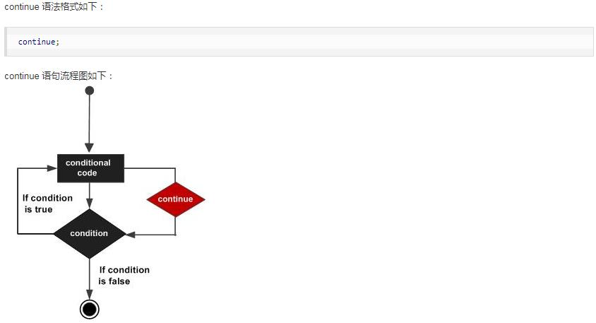
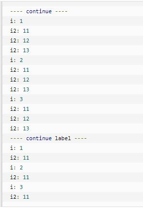

### **循环语句for**

#### **一，for循环语句结构**
如果想要重复执行某些语句，Go 语言中您只有 for 结构可以使用。不要小看它，这个 for 结构比其它语言中的更为灵活。
* 以下为大多编程语言循环程序的流程图：


* Go 语言提供了以下几种类型循环处理语句：


#### **1. for循环**
**_1.1 - 语法_** :
Go 语言的 For 循环有 3 种形式，只有其中的一种使用分号。

形式1：和 C 语言的 for 一样：

`for init; condition; post { }`

形式2： 和 C 的 while 一样：

`for condition { }`

形式3： 和 C 的 for(;;) 一样：
     
`for { }`

* **init**： 一般为赋值表达式，给控制变量赋初值；
* **condition**： 关系表达式或逻辑表达式，循环控制条件；
* **post**： 一般为赋值表达式，给控制变量增量或减量

**_1.2 - for语句执行过程及流程_**

for语句执行过程如下：
* 1、先对表达式 1 赋初值；
* 2、判别赋值表达式 init 是否满足给定条件，若其值为真，满足循环条件，则执行循环体内语句，然后执行 post，进入第二次循环，再判别 condition；否则判断 condition 的值为假，不满足条件，就终止for循环，执行循环体外语句。
* 3、for语句语法流程如下图所示：


**_实例 1 -_** condition 套用函数

```
package main

import (
	"fmt"
)

var a = 5
var b = "string"

func main() {

	for i := 0; i < len(b); i++ {
		a++
		fmt.Println(a)
	}

	fmt.Println("game over")
}
```
**输出结果:**


* **值得注意的是：** for语法结构中condition若存在函数，是比较吃内存的，因为每循环一次都要检测这个函数。条件允许的情况下考虑把该函数转为局部/全局变量
比如：
```
package main

import (
	"fmt"
)

var a = 5
var b = "string"
var x = len(b) // 这里用全局变量x代替上例中for语法结构中的函数
func main() {

	for i := 0; i < x; i++ {
		a++
		fmt.Println(a)
	}

	fmt.Println("game over")
}
```
**_实例 2 -_** 无限循环:
```
package main

import "fmt"

func main() {
        sum := 0
        for {
            sum++ // 无限循环下去
        }
        fmt.Println(sum) // 无法输出
}
```
* **小提示**： 要停止无限循环，可以在命令窗口按下ctrl+c 。

**_实例 3 -_** For-each range 循环


*输出结果*:
```
0 google
1 runoob
第 0 位 x 的值 = 1
第 1 位 x 的值 = 2
第 2 位 x 的值 = 3
第 3 位 x 的值 = 5
第 4 位 x 的值 = 0
第 5 位 x 的值 = 0
```
**_实例 4 -_** 九九乘法表
```
//自己的傻瓜套路
package main

import "fmt"

var a,b,c,d int

func main() {
b:=[]int{1,2,3,4,5,6,7,8,9}

    for a:=1;a<10;a++{
	    for d:= range b {
	    c=a*b[d]
	    fmt.Printf("%d * %d = %d\n",a,b[d],c)
        }
    }
}
```
* 跟下面的精简方案比，多用了一个参数，一个数组，和一个函数

```
package main

import "fmt"

var a, b, c int

func main() {

	for a := 1; a < 10; a++ {
		for b := 1; b < 10; b++ {
			c = a * b
			fmt.Printf("%d * %d = %d\n", a, b, c)
		}
	}
}
```

#### **二，循环控制语句**

功能： 循环控制语句可以控制循环体内语句的执行过程

GO 语言支持以下几种循环控制语句：



#### **break语句**

Go 语言中 break 语句用于以下两方面：

* 用于循环语句中跳出循环，并开始执行循环之后的语句。
* break 在 switch（开关语句）中在执行一条 case 后跳出语句的作用。
* 在多重循环中，可以用标号 label 标出想 break 的循环。

##### **语法**

break 语法格式如下：



**_实例 5 -_**

```
package main

import "fmt"

func main() {
   /* 定义局部变量 */
   var a int = 10

   /* for 循环 */
   for a < 20 {
      fmt.Printf("a 的值为 : %d\n", a);
      a++;
      if a > 15 {
         /* 使用 break 语句跳出循环 */
         break;
      }
   }
}
```
*输出结果*:
```
a 的值为 : 10
a 的值为 : 11
a 的值为 : 12
a 的值为 : 13
a 的值为 : 14
a 的值为 : 15
```

##### **在go语言中，break语句后可以加上标签。** 
* 如果加了标签，就会跳出标签对应的for循环。

**_实例 6 -_**

```
package main
import (
	"fmt"
)

func main() {
	//label1:
	for i := 0; i < 4; i++ {
		for j := 0; j < 10; j++ {
			if j == 2{
				break // label1
			}
			fmt.Println("j = ", j)
		}
	}
}
```
*输出结果*：（上面代码中把两个标签代码备注掉了）

```
j = 0
j = 1
j = 0
j = 1
j = 0
j = 1
j = 0
j = 1
```

* 如果使用标签：



* 上面例子中，break后的标签label1指定的就是最外层的for循环，所以当j等于2时，直接结束了所有的循环。
ps：continue语句也支持标签功能


#### **continue语句**

* Go 语言的 continue 语句 有点像 break 语句。但是 continue 不是跳出循环，而是跳过当前循环执行下一次循环语句。

* for 循环中，执行 continue 语句会触发 for 增量语句的执行。

* 在多重循环中，可以用标号 label 标出想 continue 的循环。

##### **语法**



**_实例 7 -_**

```
package main

import "fmt"

var x int

func main (){

	for x = 1; x <= 7; x++ {
	
		fmt.Printf("第 %d 次的结果是x = %d\n",x,x)
		
			if x == 3 {
					x=x+1
					continue // 这里用continue跳过了4
			}
	
	}

}
```

*输出结果*：
```
第 1 次的结果是x = 1
第 2 次的结果是x = 2
第 3 次的结果是x = 3
第 5 次的结果是x = 5
第 6 次的结果是x = 6
第 7 次的结果是x = 7
```

##### **continue 标签的用法**

**_实例 8 -_**
```
package main

import "fmt"

func main() {

    // 不使用标记
    fmt.Println("---- continue ---- ")
    for i := 1; i <= 3; i++ {
        fmt.Printf("i: %d\n", i)
            for i2 := 11; i2 <= 13; i2++ {
                fmt.Printf("i2: %d\n", i2)
                continue
            }
    }

    // 使用标记
    fmt.Println("---- continue label ----")
    re:
        for i := 1; i <= 3; i++ {
            fmt.Printf("i: %d\n", i)
                for i2 := 11; i2 <= 13; i2++ {
                    fmt.Printf("i2: %d\n", i2)
                    continue re
                }
        }
}
```
*输出结果*：

