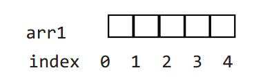
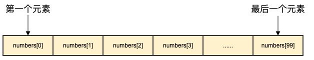
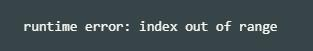
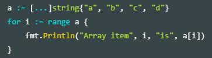

### **数组与切片**

#### **写在前面**

这章我们开始剖析 容器 , 它是可以包含大量条目（item）的数据结构，例如数组、切片和 map。从这看到 Go 明显受到 Python 的影响。

以 `[]` 符号标识的数组类型几乎在所有的编程语言中都是一个基本主力。Go 语言中的数组也是类似的，只是有一些特点。Go 没有 C 那么灵活，但是拥有切片（slice）类型。这是一种建立在 Go 语言数组类型之上的抽象，要想理解切片我们必须先理解数组。数组有特定的用处，但是却有一些呆板，所以在 Go 语言的代码里并不是特别常见。相对的，切片却是随处可见的。它们构建在数组之上并且提供更强大的能力和便捷。

#### **一，声明和初始化**

#### **1.1概念和声明**

* 数组：数组是具有相同 唯一类型 的一组已编号且长度固定的数据项序列（这是一种同构的数据结构）；这种类型可以是任意的原始类型例如整型、字符串或者自定义类型。数组长度必须是一个常量表达式，并且必须是一个非负整数。数组长度也是数组类型的一部分，所以 [5] int 和 [10] int 是属于不同类型的。

【注意事项】：如果我们想让数组元素类型为任意类型的话可以使用空接口作为类型。当使用值时我们必须先做一个类型判断。[传送门]()

数组元素可以通过 索引（位置）来读取（或者修改），索引从 0 开始，第一个元素索引为 0，第二个索引为 1，以此类推。（数组以 0 开始在所有类 C 语言中是相似的）。元素的数目，也称为长度或者数组大小必须是固定的并且在声明该数组时就给出（编译时需要知道数组长度以便分配内存）；*_数组长度最大为 2Gb。_*

*声明的格式是：*
`var identifier [len]type`
> 例如：
`var arr1 [5]int` // 这里5就是长度，表示数组有5个元素，跟索引是两个概念

> 在内存中的结构是：




> number0, number1, ..., number99 的变量，使用数组形式 numbers[0], numbers[1] ..., numbers[99] 



【注意事项】：每个元素是一个整型值，当声明数组时所有的元素都会被自动初始化为默认值 0。比如：arr1 的长度是 5，索引范围从 0 到 `len(arr1)-1`

第一个元素是 `arr1[0]`，第三个元素是 `arr1[2]`；总体来说索引 i 代表的元素是 `arr1[i]`，最后一个元素是 `arr1[len(arr1)-1]`。

*_对索引项为 i 的数组元素赋值可以这么操作：arr[i] = value，所以数组是 可变的_*

只有有效的索引可以被使用，当使用等于或者大于 len(arr1) 的索引时：如果编译器可以检测到，会给出索引超限的提示信息；如果检测不到的话编译会通过而运行时会 panic



#### **1.2初始化和数组的指针**
#### *1.2.1 数组的初始化*
由于索引的存在，遍历数组的方法自然就是使用 for 结构:
> 释义:所谓遍历，是指沿着某条搜索路线，依次对树中每个结点均做一次且仅做一次访问。

* 通过 for 初始化数组项
* 通过 for 打印数组元素
* 通过 for 依次处理元素

##### *_示例 - 1.2.1.1_*
```
package main
import "fmt"

func main() {
    var arr1 [5]int

    for i:=0; i < len(arr1); i++ {
        arr1[i] = i * 2
    }

    for i:=0; i < len(arr1); i++ {
        fmt.Printf("Array at index %d is %d\n", i, arr1[i])
    }
}
```
*输出结果：*
```
Array at index 0 is 0
Array at index 1 is 2
Array at index 2 is 4
Array at index 3 is 6
Array at index 4 is 8
```

*_重点 - 1_*：for 循环中的条件非常重要：
* `i < len(arr1)`，如果写成 `i <= len(arr1)` 的话会产生越界错误。
```
for i:=0; i < len(arr1); i++｛
    arr1[i] = ...
}
```
* 也可以使用 for-range 的生成方式：
```
for i,_:= range arr1 {
...
}
```
> 在这里 i 也是数组的索引。当然这两种 for 结构对于切片（slices）来说也同样适用。

**问题：**下面代码段的输出是什么？




*输出结果：*
```
Array item 0 is a
Array item 1 is b
Array item 2 is c
Array item 3 is d
```
#### *1.2.2 数组的初始化*
*_重点 - 2_*：Go 语言中的数组是一种 值类型（不像 C/C++ 中是指向首元素的指针）

* 可以通过 new() 来创建： `var arr1 = new([5]int)`。

> 那么这种方式和 var arr2 [5]int 的区别是什么呢？

* **arr1 的类型是 `*[5]int`，而 arr2 的类型是 `[5]int`**
> 这样的情况下，当把一个数组赋值给另一个时，需要在做一次数组内存的拷贝操作。例如：
```
arr2 := *arr1 // 这里相当于对指针类型使用了反向指针，起到拷贝的作用
arr2[2] = 100
```
这样两个数组就有了不同的值，在赋值后修改 arr2 不会对 arr1 生效。
[**指针传送门**](./day08a.md)

所以在函数中数组作为参数传入时，如 func1(arr2)，会产生一次数组拷贝，func1 方法不会修改原始的数组 arr2。

如果你想修改原数组，那么 arr2 必须通过 & 操作符以引用方式传过来，例如 func1 (&arr2），下面是一个例子
##### *_示例 - 1.2.2.1_*
```
package main
import "fmt"
func f(a [3]int) { fmt.Println(a) }
func fp(a *[3]int) { fmt.Println(a) }

func main() {
    var ar [3]int
    f(ar)   // passes a copy of ar
    fp(&ar) // passes a pointer to ar
}
```
*输出结果：*
```
[0 0 0]
&[0 0 0]
```
> 假如去掉代码中最后一行的 `&`,运行时会报错如下:
```
# command-line-arguments
.\slice.go:22:7: cannot use ar (type [3]int) as type *[3]int in argument to fp
//上文中代码fp是指针类型，不用&转换，会报错
```

【练习】 - [传送门](../Codes/arr_slice.md)

练习 1：array_value.go: 证明当数组赋值时，发生了数组内存拷贝。

练习 2：for_array.go: 写一个循环并用下标给数组赋值（从 0 到 15）并且将数组打印在屏幕上。

练习 3：fibonacci_array.go: 在第 6.6 节我们看到了一个递归计算 Fibonacci 数值的方法。但是通过数组我们可以更快的计算出 Fibonacci 数。完成该方法并打印出前 50 个 Fibonacci 数字。