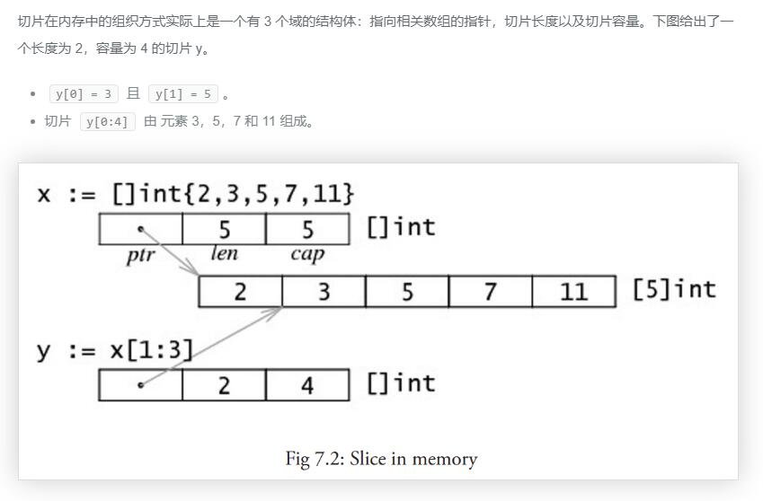
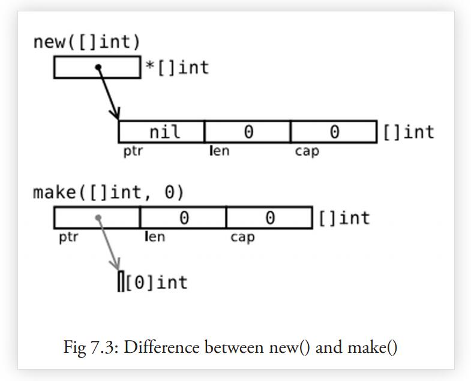

### **Go语言中的切片**

#### **一，切片的概念** 【小圆点项记录的都是必看必记】
#### *1.1 了解切片*
切片（slice）是对数组一个连续片段的引用（该数组我们称之为相关数组，通常是匿名的），所以切片是一个引用类型。这个片段可以是整个数组，或者是由起始和终止索引标识的一些项的子集。需要注意的是，终止索引标识的项不包括在切片内。切片提供了一个相关数组的动态窗口。
* 切片是可索引的，并且可以由 `len()` 函数获取长度。

给定项的切片索引可能比相关数组的相同元素的索引小。和数组不同的是，切片的长度可以在运行时修改，最小为 0 最大为相关数组的长度：
* 切片是一个 *_长度可变的数组_*

切片提供了计算容量的函数 `cap()` 可以测量切片最长可以达到多少：它等于切片从第一个元素开始，到相关数组末尾的元素个数。如果 s 是一个切片，`cap(s)` 就是从 `s[0]` 到数组末尾的数组长度。
* 切片的长度永远不会超过它的容量，所以对于 切片 s 来说该不等式永远成立：`0 <= len(s) <= cap(s)`。

多个切片如果表示同一个数组的片段，它们可以共享数据；因此一个切片和相关数组的其他切片是共享存储的，相反，不同的数组总是代表不同的存储。数组实际上是切片的构建块。
* 优点 因为切片是引用，所以它们不需要使用额外的内存并且比使用数组更有效率，所以在 Go 代码中 切片比数组更常用。

#### *1.2 如何声明切片*

*_声明切片的格式是_*: `var identifier []type` （不需要说明长度）
* 一个切片在未初始化之前默认为 nil，长度为 0。
* 切片的初始化格式是`var slice1 []type = arr1[start:end]`
    
 【**划重点**】 —— 这表示 slice1 是由数组 arr1 从 start 索引到 end-1 索引之间的元素构成的子集（切分数组，start:end 被称为 slice 表达式）。所以 slice1[0] 就等于 arr1[start]。这可以在 arr1 被填充前就定义好。
 
 [1] 如果某个人写：`var slice1 []type = arr1[:]` 那么 slice1 就等于完整的 arr1 数组（所以这种表示方式是`arr1[0:len(arr1)]` 的一种缩写）。另外一种表述方式是：`slice1 = &arr1`。
 
 [2] `arr1[:3]`和 `arr1[0:3]` 相同，包含了从第一个到第三个元素（**不包括第三个**）。 
 
 [3] 如果你想去掉 slice1 的最后一个元素，只要 `slice1 = slice1[:len(slice1)-1]`。  
 
 [4] s2 := s[:] 是用切片组成的切片，拥有相同的元素，*_但是仍然指向相同的相关数组_*
 
 [5] 一个切片 s 可以这样扩展到它的大小上限：`s = s[:cap(s)]`，如果再扩大的话就会导致运行时错误
 
 [6] 对于每一个切片（包括 string），以下状态总是成立的：
 ```
 s == s[:i] + s[i:] // i是一个整数且: 0 <= i <= len(s)
 len(s) <= cap(s)
 ```
 
 [7] 如果 s2 是一个 slice，你可以将 s2 向后移动一位 s2 = s2[1:]，但是末尾没有移动。切片只能向后移动，s2 = s2[-1:] 会导致编译错误。切片不能被重新分片以获取数组的前一个元素。
 * 注意 绝对不要用指针指向 slice。切片本身已经是一个引用类型，所以**它本身就是一个指针！！**
 
 [8] 切片也可以用类似数组的方式初始化：`var x = []int{2, 3, 5, 7, 11}`。这样就创建了一个长度为 5 的数组并且创建了一个相关切片。
 
 
 
 
 
 
 
 
 
 
 ##### *_示例1.2 - 1_*
 ```go
 package main
 import "fmt"
 
 func main() {
     var arr1 [6]int
     var slice1 []int = arr1[2:5] // item at index 5 not included!
 
     // load the array with integers: 0,1,2,3,4,5
     for i := 0; i < len(arr1); i++ {
         arr1[i] = i
     }
 
     // print the slice
     for i := 0; i < len(slice1); i++ {
         fmt.Printf("Slice at %d is %d\n", i, slice1[i])
     }
 
     fmt.Printf("The length of arr1 is %d\n", len(arr1))
     fmt.Printf("The length of slice1 is %d\n", len(slice1))
     fmt.Printf("The capacity of slice1 is %d\n", cap(slice1))
 
     // grow the slice
     slice1 = slice1[0:4]
     for i := 0; i < len(slice1); i++ {
         fmt.Printf("Slice at %d is %d\n", i, slice1[i])
     }
     fmt.Printf("The length of slice1 is %d\n", len(slice1))
     fmt.Printf("The capacity of slice1 is %d\n", cap(slice1))
 
     // grow the slice beyond capacity
     //slice1 = slice1[0:7 ] // panic: runtime error: slice bound out of range
 }
 ```
 *输出结果：*
 ```
 Slice at 0 is 2  
 Slice at 1 is 3  
 Slice at 2 is 4  
 The length of arr1 is 6  
 The length of slice1 is 3  
 The capacity of slice1 is 4  
 Slice at 0 is 2  
 Slice at 1 is 3  
 Slice at 2 is 4  
 Slice at 3 is 5  
 The length of slice1 is 4  
 The capacity of slice1 is 4
 ```
 *问题：* 给定切片 b:= []byte{'g', 'o', 'l', 'a', 'n', 'g'}，那么 b[1:4]、b[:2]、b[2:] 和 b[:] 分别是什么？
 * 这里很好的呈现了第[6]点提到的`s == s[:i] + s[i:]`
 > 解析：
 ```go
 package main
 
 import "fmt"
 
 func main(){
 
 	b:= []byte{'g', 'o', 'l', 'a', 'n', 'g'}
 	
 	fmt.Println(b[1:4])
 	fmt.Println(b[:2])
 	fmt.Println(b[2:])
 	fmt.Println(b[:])
 	
 }
 ```
 *输出结果A：*
 ```
 [111 108 97]
 [103 111]
 [108 97 110 103]
 [103 111 108 97 110 103]
 ```
  *输出结果B：*
 ```
 //为了更加直观，我们把代码块中byte改成string | b:= []string{"g", "o", "l", "a", "n", "g"}
 [o l a]
 [g o]
 [l a n g]
 [g o l a n g]

 ```
 
 #### *1.3 将切片传递给函数*
 如果你有一个函数需要对数组做操作，你可能总是需要把参数声明为切片。当你调用该函数时，把数组分片，创建为一个 切片引用并传递给该函数。这里有一个计算数组元素和的方法:
 
 ```go
 func sum(a []int) int {
     s := 0
     for i := 0; i < len(a); i++ {
         s += a[i]
     }
     return s
 }
 
 func main() {
     var arr = [5]int{0, 1, 2, 3, 4}
     sum(arr[:])
 }
 ```
 
 
 #### **二，切片的创建**
 #### *2.1 用 make () 创建一个切片*
 
 [1] *_当相关数组还没有定义时_*，我们可以使用 make () 函数来创建一个切片 同时创建好相关数组：`var slice1 []type = make([]type, len)`。
 
 —— 也可以简写为 `slice1 := make([]type, len)`，这里 len 是数组的长度并且也是 slice 的初始长度。
 
 [2] make 接受 2 个参数：元素的类型以及切片的元素个数。
 
 —— 如果你想创建一个 slice1，它不占用整个数组，而只是占用以 len 为个数个项，那么只要：`slice1 := make([]type, len, cap)`。
 
 [3] make 的使用方式是：`func make([]T, len, cap)`，其中 **cap 是可选参数**。
 > 所以下面两种方法可以生成相同的切片：
 ```
 make([]int, 50, 100)
 new([100]int)[0:50]
 ```
 > 下图描述了使用 make 方法生成的切片的内存结构：
 ```go
 package main
 import "fmt"
 
 func main() {
     var slice1 []int = make([]int, 10)
     // load the array/slice:
     for i := 0; i < len(slice1); i++ {
         slice1[i] = 5 * i
     }
 
     // print the slice:
     for i := 0; i < len(slice1); i++ {
         fmt.Printf("Slice at %d is %d\n", i, slice1[i])
     }
     fmt.Printf("\nThe length of slice1 is %d\n", len(slice1))
     fmt.Printf("The capacity of slice1 is %d\n", cap(slice1))
 }
 ```
 *输出结果： *
 ```
 Slice at 0 is 0  
 Slice at 1 is 5  
 Slice at 2 is 10  
 Slice at 3 is 15  
 Slice at 4 is 20  
 Slice at 5 is 25  
 Slice at 6 is 30  
 Slice at 7 is 35  
 Slice at 8 is 40  
 Slice at 9 is 45  
 
 The length of slice1 is 10  
 The capacity of slice1 is 10 
 ```
 【**小贴士：**】因为字符串是纯粹不可变的字节数组，它们也可以被切分成 切片。
 
 【练习2.1 - 1：】 fobinacci_funcarray.go: 练习主函数调用一个使用序列个数作为参数的函数，该函数返回一个大小为序列个数的 Fibonacci 切片。
 [传送门](./codes/d15slice.go)
 
  #### *2.2 new () 和 make () 的区别*
  
  看起来二者没有什么区别，都在堆上分配内存，但是它们的行为不同，适用于不同的类型。
  
  * new (T) 为每个新的类型 T 分配一片内存，初始化为 0 并且返回类型为 * T 的内存地址：这种方法**返回一个指向类型为 T，值为 0 的地址的指针**，它适用于值类型如数组和结构体；它相当于 `&T{}`。
  * make(T) **返回一个类型为 T 的初始值**，它只适用于 3 种内建的引用类型：<font color="red">切片、map 和 channel</font>
  
  换言之，new 函数分配内存，make 函数初始化；下图给出了区别：
  
  
  
  
  
  
  
  
  
 
 > 在这幅图中`new([]int)`:
 ```
 var p *[]int = new([]int) // *p == nil; with len and cap 0
 p := new([]int)
 ```
  > 在这幅图中`make([]int, 0)`:
  
  `p := make([]int, 0)` ，切片 已经被初始化，但是指向一个空的数组。
  
  > 以上两种方式实用性都不高。下面的方法：
  
 `var v []int = make([]int, 10, 50) // 方法一`
 
 `v := make([]int, 10, 50) // 方法二`
  
  这样分配一个有 50 个 int 值的数组，并且创建了一个长度为 10，容量为 50 的 切片 v，该 切片 指向数组的前 10 个元素。
  
  *问题2.2 - 1：* 给定 `s := make([]byte, 5)`，`len (s)` 和` cap (s) `分别是多少？`s = s[2:4]`，`len (s)` 和 `cap (s) `又分别是多少？
   > 解析：
  ```go
  package main
  
  import "fmt"
  
  func main(){
  
  	s := make([]byte, 5)
  	
  	fmt.Printf("len (s) = %d\n",len (s))
  	fmt.Printf("cap (s) =%d\n ",cap (s))
  
  	fmt.Println("*******分割线*******")
  	
  	s1 := s[2:4]
  	fmt.Printf("len (s1) = %d\n",len (s1))
  	fmt.Printf("cap (s1) =%d\n ",cap (s1))
  	
  	
  }
  ```
  *输出结果：*
  ```
  len (s) = 5
  cap (s) =5
   *******分割线*******
  len (s1) = 2
  cap (s1) =3
  ``` 
  
   #### *2.3 多维 切片*
   和数组一样，切片通常也是一维的，但是也可以由一维组合成高维。通过分片的分片（或者切片的数组），长度可以任意动态变化。
   
   所以 Go 语言的多维切片可以任意切分。而且，内层的切片必须单独分配（通过 make 函数）。
   
   #### *2.4 bytes 包*
   
   类型 `[]byte`的切片十分常见，Go 语言有一个 bytes 包专门用来解决这种类型的操作方法。
   
   * bytes 包和字符串包十分类似。而且它还包含一个十分有用的类型 Buffer:
   ```go
   import "bytes"
   
   type Buffer struct {
       ...
   }
   ```
   这是一个长度可变的 bytes 的 buffer，提供 Read 和 Write 方法，因为**读写长度未知的 bytes 最好使用 buffer**。
   
   [1] Buffer 可以这样定义：`var buffer bytes.Buffer`。
   
   [2] 或者使用 new 获得一个指针：var r *bytes.Buffer = new(bytes.Buffer)。
   
   [3] 或者通过函数：`func NewBuffer(buf []byte) *Buffer`，创建一个 Buffer 对象并且用 buf 初始化好；NewBuffer 最好用在从 buf 读取的时候使用。
   
   * *_通过 buffer 串联字符串_* （类似于 Java 的 StringBuilder 类）
    
  > 在下面的代码段中，我们创建一个 buffer，通过 `buffer.WriteString(s)` 方法将字符串 s 追加到后面，最后再通过 `buffer.String() `方法转换为 string：
  
  这种实现方式比使用 += 要更节省内存和 CPU，尤其是要串联的字符串数目特别多的时候。
  
 【练习2.4 - 1】 给定切片 sl，将一个 []byte 数组追加到 sl 后面。写一个函数 `Append(slice, data []byte) []byte`，该函数在 sl 不能存储更多数据的时候自动扩容。
 
 【练习2.4 - 2】 把一个缓存 buf 分片成两个 切片：第一个是前 n 个 bytes，后一个是剩余的，用一行代码实现。
 
  #### **三，For-range 结构**
  
  #### *3.1 range 关键字*
  
 Go 语言中 range 关键字用于 for 循环中迭代数组(array)、切片(slice)、通道(channel)或集合(map)的元素。在数组和切片中它返回元素的索引和索引对应的值，在集合中返回 key-value 对。
 > 这种构建方法可以应用于数组和切片:
 ```go
 for ix, value := range slice1 {
     ...
 }
 ```
 【**重要**】
 * 第一个返回值 ix 是数组或者切片的索引，第二个是在该索引位置的值；他们都是仅在 for 循环内部可见的局部变量。
 * value 只是 slice1 某个索引位置的值的一个拷贝，不能用来修改 slice1 该索引位置的值。
 
 ##### *_示例3.1-1_*
 ```go
 package main
 
 import "fmt"
 
 func main() {
     var slice1 []int = make([]int, 4)
 
     slice1[0] = 1
     slice1[1] = 2
     slice1[2] = 3
     slice1[3] = 4
 
     for ix, value := range slice1 {
         fmt.Printf("Slice at %d is: %d\n", ix, value)
     }
 }

 ```
  ##### *_示例3.1-2_*
  ```go
  package main
  import "fmt"
  
  func main() {
      seasons := []string{"Spring", "Summer", "Autumn", "Winter"}
      for ix, season := range seasons {
          fmt.Printf("Season %d is: %s\n", ix, season)
      }
  
      var season string
      for _, season = range seasons { //这里空白符_ 忽略了索引
          fmt.Printf("%s\n", season)
      }
  }
  ```
  * 给出了一个关于字符串的例子， _ 可以用于忽略索引。
 > 如果你只需要索引，你可以忽略第二个变量，例如：
 ```go
 for ix := range seasons {
     fmt.Printf("%d", ix)
 }
 // Output: 0 1 2 3
 ```
 
   #### *3.2 多维切片下的 for-range*
   
  > 通过计算行数和矩阵值可以很方便的写出如下 for 循环来：
  ```go
  for row := range screen {
      for column := range screen[row] {
          screen[row][column] = 1
      }
  }
  ```
  【练习3.2 - 1：】假设我们有如下数组：items := [...]int{10, 20, 30, 40, 50}
  
  a) 如果我们写了如下的 for 循环，那么执行完 for 循环后的 items 的值是多少？如果你不确定的话可以测试一下
  ```
  for _, item := range items {
      item *= 2
  }
  ```
  b) 如果 a) 无法正常工作，写一个 for 循环让值可以 double。
  
  【练习3.2 - 2：】 sum_array.go
  
  a) 写一个 Sum 函数，传入参数为一个 32 位 float 数组成的数组 arrF，返回该数组的所有数字和。
  
  如果把数组修改为切片的话代码要做怎样的修改？如果用切片形式方法实现不同长度数组的的和呢？
  
  b) 写一个 SumAndAverage 方法，返回两个 int 和 float32 类型的未命名变量的和与平均值。
  
  【练习3.2 - 3：】min_max.go
  
  写一个 minSlice 方法，传入一个 int 的切片并且返回最小值，再写一个 maxSlice 方法返回最大值。
 
  #### **四，切片的其他操作**
  
  #### *4.1 切片重组（reslice）*
  
> 我们已经知道切片创建的时候通常比相关数组小，例如：
  
 `slice1 := make([]type, start_length, capacity)`

 其中 start_length 作为切片初始长度而 capacity 作为相关数组的长度。

 这么做的好处是我们的切片在达到容量上限后可以扩容。
 
 *_定义：_* 改变切片长度的过程称之为切片重组 reslicing，做法如下：
 * `slice1 = slice1[0:end]`，其中 end 是新的末尾索引（即长度）。
 
 [1] 将切片扩展 1 位可以这么做：`sl = sl[0:len(sl)+1]`
 
 [2] 切片可以反复扩展直到占据整个相关数组。
 ```go
 package main
 import "fmt"
 
 func main() {
     slice1 := make([]int, 0, 10)
     // load the slice, cap(slice1) is 10:
     for i := 0; i < cap(slice1); i++ {
         slice1 = slice1[0:i+1]
         slice1[i] = i
         fmt.Printf("The length of slice is %d\n", len(slice1))
     }
 
     // print the slice:
     for i := 0; i < len(slice1); i++ {
         fmt.Printf("Slice at %d is %d\n", i, slice1[i])
     }
 }
 ```
 *输出结果：*
 ```
 The length of slice is 1
 The length of slice is 2
 The length of slice is 3
 The length of slice is 4
 The length of slice is 5
 The length of slice is 6
 The length of slice is 7
 The length of slice is 8
 The length of slice is 9
 The length of slice is 10
 Slice at 0 is 0
 Slice at 1 is 1
 Slice at 2 is 2
 Slice at 3 is 3
 Slice at 4 is 4
 Slice at 5 is 5
 Slice at 6 is 6
 Slice at 7 is 7
 Slice at 8 is 8
 Slice at 9 is 9
 ```
 
 > 另一个例子：
 ```
 var ar = [10]int{0,1,2,3,4,5,6,7,8,9}
 var a = ar[5:7] // reference to subarray {5,6} - len(a) is 2 and cap(a) is 5
 ```
 > 将 a 重新分片：
 `a = a[0:4] // ref of subarray {5,6,7,8} - len(a) is now 4 but cap(a) is still 5`
 
 【问题4 - 1】：
 
 a) 如果 a 是一个切片，那么 `s[n:n]` 的长度是多少？
 
 b) `s[n:n+1]`的长度又是多少？
 
  #### *4.2 切片的复制与追加*
  
  如果想增加切片的容量，我们必须创建一个新的更大的切片并把原分片的内容都拷贝过来。下面的代码描述了从拷贝切片的 copy 函数和向切片追加新元素的 append 函数。
  
  ##### *_示例4.2 - 1:_*
  
  ```go
  package main
  import "fmt"
  
  func main() {
  	sl_from := []int{1, 2, 3}
  	sl_to := make([]int, 10)
  
  	n := copy(sl_to, sl_from)
  	fmt.Println(sl_to)
  	fmt.Printf("Copied %d elements\n", n) // n == 3
  
  	sl3 := []int{1, 2, 3}
  	sl3 = append(sl3, 4, 5, 6)
  	fmt.Println(sl3)
  }
  ```
  
  `func append(s[]T, x ...T) []T` 其中 append 方法将 0 个或多个具有相同类型 s 的元素追加到切片后面并且返回新的切片；追加的元素必须和原切片的元素同类型。如果 s 的容量不足以存储新增元素，append 会分配新的切片来保证已有切片元素和新增元素的存储。因此，返回的切片可能已经指向一个不同的相关数组了。append 方法总是返回成功，除非系统内存耗尽了。
  
  如果你想将切片 y 追加到切片 x 后面，只要将第二个参数扩展成一个列表即可：`x = append(x, y...)`。
  
  **注意**： append 在大多数情况下很好用，但是如果你想完全掌控整个追加过程，你可以实现一个这样的 AppendByte 方法：
  
  ```go
  func AppendByte(slice []byte, data ...byte) []byte {
  	m := len(slice)
  	n := m + len(data)
  	if n > cap(slice) { // if necessary, reallocate
  		// allocate double what's needed, for future growth.
  		newSlice := make([]byte, (n+1)*2)
  		copy(newSlice, slice)
  		slice = newSlice
  	}
  	slice = slice[0:n]
  	copy(slice[m:n], data)
  	return slice
  }
  ```
  
  `func copy(dst, src []T) int` copy 方法将类型为 T 的切片从源地址 src 拷贝到目标地址 dst，覆盖 dst 的相关元素，并且返回拷贝的元素个数。源地址和目标地址可能会有重叠。拷贝个数是 src 和 dst 的长度最小值。如果 src 是字符串那么元素类型就是 byte。如果你还想继续使用 src，在拷贝结束后执行 `src = dst`。
  
  **练习 4.2 - 1**
  
  给定 `slice s[]int` 和一个 int 类型的因子factor，扩展 s 使其长度为 `len(s) * factor`。
  
  **练习 4.2 - 2**
  
  用顺序函数过滤容器：s 是前 10 个整型的切片。构造一个函数 Filter，第一个参数是 s，第二个参数是一个 `fn func(int) bool`，返回满足函数 fn 的元素切片。通过 fn 测试方法测试当整型值是偶数时的情况。
  
  **练习 4.2 - 3**
  
  写一个函数 InsertStringSlice 将切片插入到另一个切片的指定位置。
  
  **练习 4.2 - 4**
  
  写一个函数 RemoveStringSlice 将从 start 到 end 索引的元素从切片 中移除。
 
  